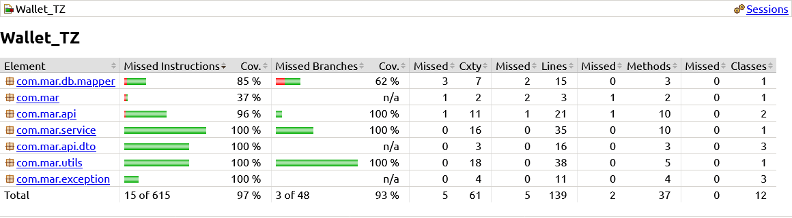

# 🤖 Wallet

## 🟢 Build and start

``` bash
mvn clean install -U
docker compose up
```

### Start integration test - Testcontainers

``` bash
mvn test -Dtest=WalletControllerIntegrationTest
```

## 📚 Project stack

- Language - Java 17
- Framework - Spring Boot
- Build - Apache Maven
- Image
    - Docker/Docker compose
- DataBase
    - PostgreSQL
    - Liquibase
- Test
    - Unit test - JUnit 5
    - Integration test - Testcontainers

## 📊 Test coverage

